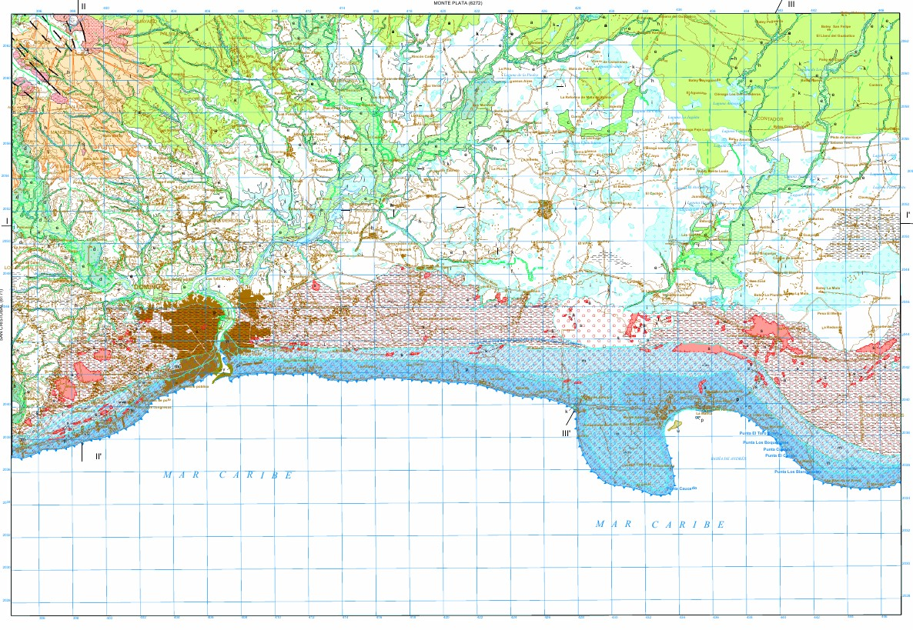

# Práctica 1. Mapa geomorfológico de RD

> Fecha de entrega: 13 de septiembre, 23:59 horas.

1. Abre una hoja del [mapa geomorfológico escala 1:100,000 de RD](https://sgn.gob.do/index.php/geologia-y-tematicos/info-geomorfologia). Asegúrate de que, el que elijas, dispone de memoria geomorfológica, y que, además, cuenta con al menos diez elementos de leyenda.

2. Concéntrate en la leyenda. Elige tres elementos de la leyenda. **IMPORTANTE**. Dado que la layenda es estándar para todo el país, algunos elementos que están en la leyenda podrían no estar representados en la hoja que elijas. Asegúrate de que los elementos de leyenda que elijas, estén representados en el mapa que hayas seleccionado.

3. Documéntate sobre ellos brevemente. Usa libros, inteligencia artificial, imágenes, artículos científicos.

4. Identifica la localización de cada uno de los tres elemento en el mapa. Anótalos.

5. Redacta, en dos párrafos, una descripción de estos tres elementos, primero indicando cuáles elegiste, y luego redactando tu descripción. No te preocupes si omites detalles técnicos o si no conoces en detalle los elementos elegidos. Investiga rápidamente sobre qué son, pero no pierdas tiempo en obtener detalles. Más bien, céntrate en describir lo que ves en el mapa, los patrones espaciales que ves en relación con dichos elementos.

6. Formula una pregunta de investigación de cada elemento elegido en su relación con el territorio.

## Definamos los criterios de evaluación

Elegimos cinco criterios de evaluación. Los destacados en negrita son los elegidos.

1. **Claridad**:

   - ¿La redacción y las preguntas son claras y fáciles de entender?
   - ¿El propósito de la pregunta de investigación está bien definido?

2. **Relevancia**:

   - ¿Se relacionan las preguntas directamente con los elementos morfológicos elegidos?
   - ¿Es relevante para el campo de la geomorfología?

3. **Especificidad**:

   - ¿Las preguntas son específicas como para guiar una investigación detallada?
   - ¿Evita preguntas vagas o demasiado generales?

4. Contexto teórico:

   - ¿La pregunta demuestra un entendimiento claro del contexto teórico y científico en el que se encuentra la geomorfología?
   - ¿Hace referencia a teorías o conceptos pertinentes?

5. Viabilidad y factibilidad:

   - ¿Las preguntas son abordables y pueden ser investigadas dentro de un marco de tiempo y recursos razonables?
   - ¿Considera las limitaciones prácticas de la investigación?

6. Originalidad e innovación:

   - ¿Las preguntas muestran un enfoque original o una perspectiva novedosa hacia los elementos morfológicos?
   - ¿Proponen nuevas ideas o enfoques?

7. Métodos de observación:

   - ¿Las preguntas sugieren métodos de observación apropiados para analizar los elementos morfológicos en cuestión?
   - ¿Consideran la disponibilidad de datos y herramientas?

8. **Potencial de contribución**:

   - ¿Las preguntas tienen el potencial de contribuir al conocimiento actual en geomorfología?
   - ¿Pueden generar información útil para la comunidad científica?

9. **Redacción y estructura**:

   - ¿La pregunta está redactada de manera clara y coherente?
   - ¿Sigue una estructura lógica y gramaticalmente correcta?

10. Creatividad y originalidad:

    - ¿Las preguntas demuestran creatividad en la formulación y enfoque de los elementos morfológicos?
    - ¿Presentan ideas novedosas o perspectivas únicas?

11. Impacto potencial:

    - ¿Se evidencia el potencial impacto de la investigación que se podría derivar de estas preguntas?
    - ¿Se pueden identificar posibles aplicaciones o implicaciones prácticas?

12. Conexión con objetivos personales o institucionales:
    - ¿Las preguntas de investigación se alinean con los objetivos personales o institucionales del investigador o del proyecto en curso?

## Usa esta escala de valoración

**Nivel 4 (Excelente)**:

- Se demuestra un profundo entendimiento del tema y del contexto teórico.
- La descripción realizada es excelente, y se explican de manera fluida la distribución y los patrones espaciales.
- Las preguntas son originales, claras, específicas, relevantes, y tienen potencial de contribución.

**Nivel 3 (Bueno)**:

- Se demuestra entendimiento del tema y algo del contexto teórico.
- La descripción realizada es legible, y se explican de forma aceptable la distribución y los patrones espaciales.
- Las preguntas son originales y específicas, pero les falta relevancia y potencial de contribución.

**Nivel 2 (Aceptable)**:

- Se demuestra algo de entendimiento del tema, y no se aporta contexto teórico.
- La descripción realizada no es fluida, y se explican de forma insuficiente la distribución y los patrones espaciales.
- Las preguntas no son originales ni específicas, y carecen de relevancia y potencial de contribución.

**Nivel 1 (En Desarrollo)**:

- No se demuestra entendimiento del tema, y no se aporta contexto teórico.
- En la descripción, sólo se explican detalles inconexos.
- Las preguntas presentadas son insuficientes.

## Solución aportada por el tali

Hoja elegida: Santo Domingo (HGM6271)

Elementos de leyenda elegidos: (1) Gravas, arenas y lutitas (Llanura de inundación). Pleistoceno-Holoceno; (2) Piedomente; (3) Dolina.

> 5. Redacta, en dos párrafos, una descripción de estos tres elementos, primero indicando cuáles elegiste, y luego redactando tu descripción. No te preocupes si omites detalles técnicos o si no conoces en detalle los elementos elegidos. Investiga rápidamente sobre qué son, pero no pierdas tiempo en obtener detalles. Más bien, céntrate en describir lo que ves en el mapa, los patrones espaciales que ves en relación con dichos elementos.

Para desarrollar esta práctica, **elegí la hoja "Santo Domingo (6271)", del Mapa geomorfológico y de procesos activos susceptibles de constituir riesgo geológico de la República Dominicana, escala 1:100,000** (Díaz de Neira, 2010). La hoja muestra la geomorfología del área correspondiente a la provincia Santo Domingo y entorno (ver figura 1). La leyenda se divide en dos grandes grupos, "Formas" y "Formaciones superficiales", que corresponden respectivamente a los elementos morfológicos (símbolos puntuales mostrados de forma unitaria o conformando tramas, así como símbolos lineales) y a los depósitos predominantes (rellenos simbolizados empleando variables visuales de tono e intensidad). Ambos elementos de leyenda pueden combinarse para dar una idea completa de la geomorfología de un área determinada, por lo que no son mututamente excluyentes.

Elegí tres elementos del mapa para aprender más sobre ellos, conocer mejor su forma de representación en el mapa, y describir sus patrones espaciales. Los elementos elegidos fueron: (1) Gravas, arenas y lutitas (Llanura de inundación). Pleistoceno-Holoceno, (2) Piedomente y (3) Dolina. A continuación, elaboro más detalles sobre cada uno de estos. Las **gravas, arenas y lutitas en llanura de inundación**, atribuidas al Pleistoceno-Holoceno, son formaciones superficiales representadas en el mapa por medio de polígonos alargados con relleno de color verde, a los cuales se les ha añadido el rótulo "h" para asistir al lector o lectora en la identificación inequívoca. Esta **formación superficial**, típica de sistemas fluviales de régimen permanente o semipermanente (Gutiérrez Elorza, 2008), conforma el **relleno de fondos de valle de múltiples arroyos y cañadas** que circulan tanto sobre la superficie del karst de plataforma del sudeste de República Dominicana, como en las áreas de piedemonte del enlace con los sistemas montañosos de la sierra de Yamasá y Los Haitises-cordillera Oriental. Por otro lado, los **piedemontes son formas** representadas en el mapa mediante líneas de trazo continuo color mamey. Comúnmente, se distribuyen rodeando al menos dos "monte-isla" (De Pedraza Gilzans, 1996) situados al norte de la ciudad de Santo Domingo, en el enlace con la sierra de Yamasá, que son los denominados "cerro Gordo" y "loma Sierra Prieta". Estas morfologías están **recubiertas por formaciones superficiales de carácter poligénico** (múltiples procesos que dan lugar a su formación), conformadas principalmente por gravas, arenas y lutitas de tonos rojizos, atribuidas al Pleistoceno. Finalmente, las **dolinas son depresiones cerradas del karst, con planta circular o elíptica \[sic\] y de tamaño relativamente pequeño, con diámetros que van comúnmente desde los pocos metros hasta, excepcionalmente, el kilómetro** (Gutiérrez Elorza, 2008). Estas depresiones se desarrollan sobre roca caliza (ocurren también en otras rocas, como los yesos, pero en el área de interés, sólo se observan en calizas), y en su génesis intervienen procesos geoquímicos de disolución y mecánicos. En la hoja de Santo Domingo, **las dolinas están rellenas fundamentalmente por arcillas de descalcificación**, atribuidas al Pleistoceno-Holoceno, y se encuentran **repartidas fundamentalmente en el karst de plataforma litoral** de la llanura sudoriental de República Dominicana.

**Figura 1**. Captura de la hoja "Santo Domingo (6271)", Mapa geomorfológico de la República Dominicana (Díaz de Neira, 2010)

> 6. Formula una pregunta de investigación de cada elemento elegido en su relación con el territorio.

- Sobre La formación superficial "gravas, arenas y lutitas en llanura de inundación", cuya representación en planta es normalmente alargada y de corta anchura, ¿es posible su delimitación con técnicas avanzadas de _machine learning_ o de _deep learning_?

- ¿Por qué en la hoja analizada la forma piedemonte sólo aparece asociada con los monte-isla? Pregunta complementaria: ¿Es posible delimitar el piedemonte basándonos sólo en la pendiente?

- ¿Tienen las dolinas de la hoja Santo Domingo un tamaño promedio de 1 ha? Pregunta complementaria: ¿Son mayoritariamente circulares o elipsoidales?

### Referencias

De Pedraza Gilsanz, J. (1996): “Geomorfología: principios, métodos y aplicaciones”, Editorial Rueda, Madrid

Díaz de Neira, A. (2010): Hoja y Memoria de Santo Domingo (6271). Mapa geomorfológico y de procesos activos susceptibles de constituir riesgo geológico de la República Dominicana, escala 1:100,000. Consorcio IGME-BRGM-INYPSA. Santo Domingo.

Gutiérrez Elorza, M. (2008). Geomorfologı́a. Pearson/Prentice Hall.
