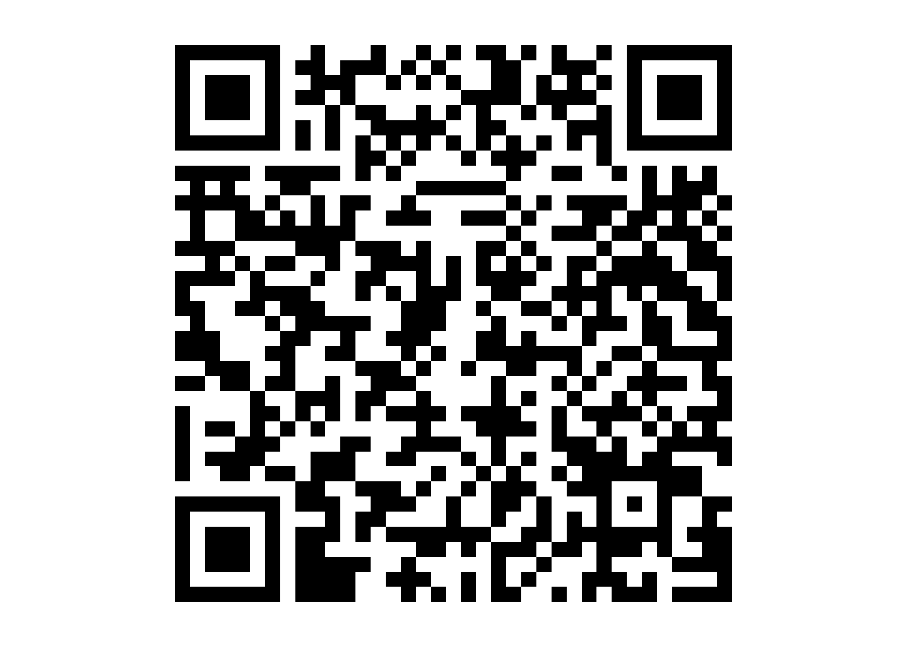
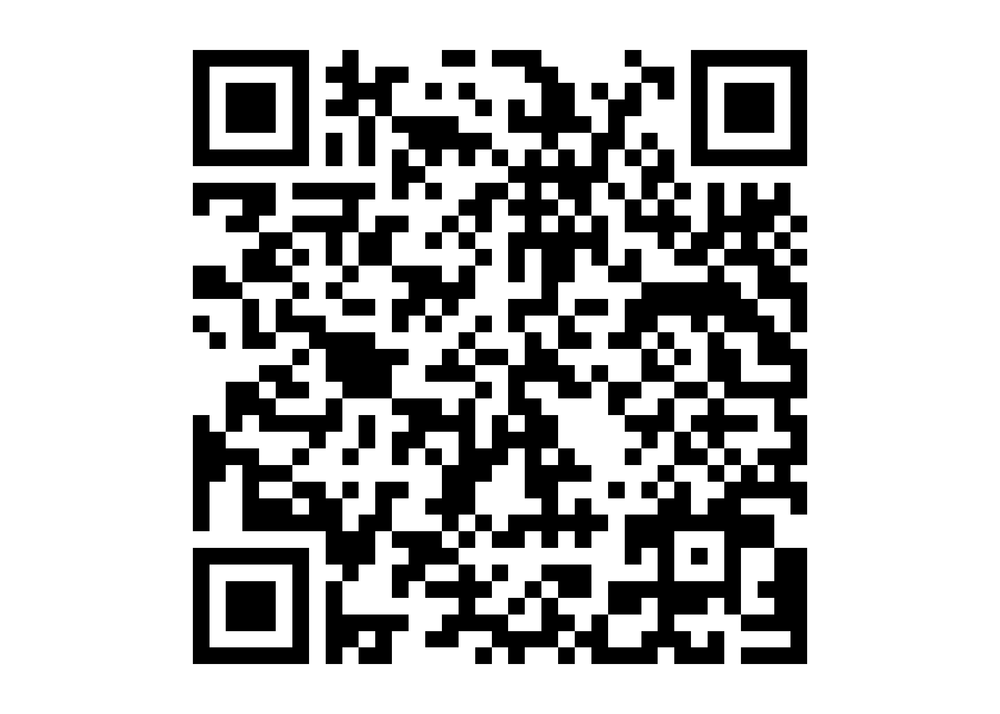

Práctica con datos GNSS
================
<b>José-Ramón Martínez-Batlle</b> (<jmartinez19@uasd.edu.do>) <br>
Facultad de Ciencias, Universidad Autónoma de Santo Domingo (UASD) <br>
Santo Domingo, República Dominicana

<!-- Este archivo se genera a partir de otro del mismo nombre con extensión .Rmd. Por favor, edita ese archivo. -->

> Fecha límite de entrega:

> Entregable: documento. Entrega tu archivo vía correo electrónico en
> formato nativo. En el caso de usar software de interfaz gráfica, como
> Microsoft Word o LibreOffice Writer, entrega tanto el archivo nativo
> .docx o .odt como el PDF. En el caso de usar procesadores de texto
> como LaTeX, Overleaf, RMmarkdown, entrega tanto el PDF como la carpeta
> (comprimida en ZIP) conteniendo los archivos necesarios para compilar
> el PDF.

-   [Datos
    GNSS](https://drive.google.com/drive/folders/1X6hwwo6vWaeIfgHXPt0J82X4EFcXFGMP?usp=drive_link)

``` r
library(qrcode)
plot(qr_code('https://drive.google.com/drive/folders/1X6hwwo6vWaeIfgHXPt0J82X4EFcXFGMP?usp=drive_link'))
```



-   [Vídeo de
    apoyo](https://drive.google.com/file/d/1j4YXlBTxb_ouYsBzqIQgPyhpCdn09WoN/view?usp=drive_link)

``` r
library(qrcode)
plot(qr_code('https://drive.google.com/file/d/1j4YXlBTxb_ouYsBzqIQgPyhpCdn09WoN/view?usp=drive_link'))
```



-Software:

-   Converter de Unicore. Para convertir archivo Unicore (de la base),
    usar Converter, que se encuentra
    [aquí](https://github.com/Stefal/rtkbase/files/14365511/converter3-0-7.zip)

-   [RTKLib Demo5](https://github.com/rtklibexplorer/RTKLIB/releases)

    -   [Versión b34i (más reciente en mayo de
        2024)](https://github.com/rtklibexplorer/RTKLIB/releases/download/b34i/demo5_b34i.zip)

-   [UCenter, de
    u-blox](https://content.u-blox.com/sites/default/files/2024-04/u-centersetup_v24.02.zip)
